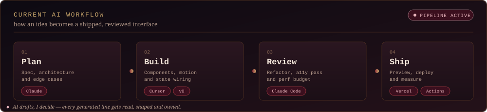

 

## Who Am I? ✦

<table>
<tr>
<td width="33%" align="center" valign="top">

  

<b>Urwah Imtiaz</b>

<i>Creative Frontend Developer</i>

 

📍 Pakistan
 
🎓 BS Artificial Intelligence — FAST-NUCES
 
🌱 Currently deep in WebGL shaders
 
☕ Fueled by chai and a good playlist

 

<a href="https://linkedin.com/in/urwahimtiaz">LinkedIn</a> · <a href="https://github.com/urrwa">GitHub</a>

</td>
<td width="67%" valign="top">

I'm a <b>Creative Frontend Developer</b> and final-year AI undergraduate at FAST-NUCES, building interfaces where motion, depth and interaction do real work — not decoration.

My focus sits at the layer where design intent becomes engineering: <b>React</b> and <b>Next.js</b> for structure, <b>GSAP</b> and <b>Framer Motion</b> for choreography, and <b>Three.js / WebGL</b> for the moments a flat page isn't enough. I care about the details people feel but rarely name — easing curves, perceived latency, whether a transition lands or just happens.

Everything I build starts away from the keyboard — a sketchbook, a mood board, a scribbled layout — before it ever becomes a component. That hand-drawn instinct is exactly what's shaping my current project.

<blockquote>
✦ Right now I'm building <b>The Sketch Dimension</b> — a hand-drawn interactive portfolio world you explore rather than scroll — while finishing my degree and pushing further into shader work.
</blockquote>

Open to collaborating on creative frontend, motion design and WebGL projects. If it needs to feel alive, I'm in.

</td>
</tr>
</table>

## Beyond the Code

<table>
<tr>
<td width="20%" align="center">📓 <b>Sketchbook</b> before Figma before code</td>
<td width="20%" align="center">🌙 <b>Most creative</b> 11 PM &mdash; 3 AM</td>
<td width="20%" align="center">🎧 <b>Debugging</b> needs a playlist on loop</td>
<td width="20%" align="center">🧵 <b>Will nudge</b> a transition by 20ms and smile</td>
<td width="20%" align="center">🎨 <b>Believes UI</b> should feel like a mood board</td>
</tr>
</table>

## Current AI Workflow

> [!NOTE]
> **Interfaces are judged in milliseconds.**
> I design for how it feels first, then write the code that defends it. AI accelerates the drafting — the taste, the structure and the final call stay mine.

## Tech Stack

**Frontend & Structure**
 

  

**Motion, 3D & Design**
 

  

**Tools**
 

## GitHub Stats

## Trophy Case

## Contribution Snake

<picture>
<source media="(prefers-color-scheme: dark)" srcset="https://raw.githubusercontent.com/urrwa/urrwa/output/github-contribution-grid-snake-dark.svg" />

</picture>

<!-- snake generated by GitHub Action: .github/workflows/snake.yml (Platane/snk) -->

## Let's Connect

If this corner of GitHub gave you even a little inspiration — a follow means a lot and keeps the shader experiments coming. ✦

<!-- Themed in dark red, brown & navy — a soft, aesthetic take on a dark developer profile -->
